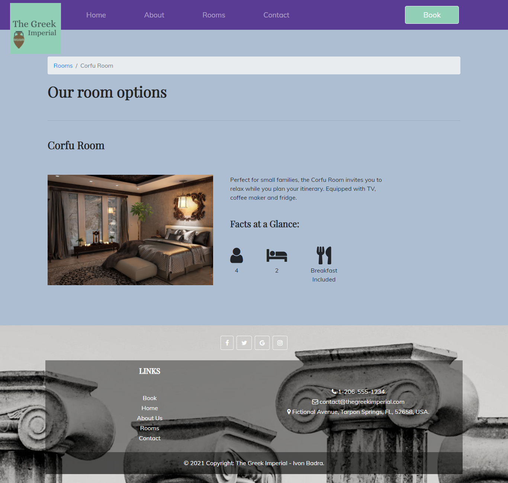
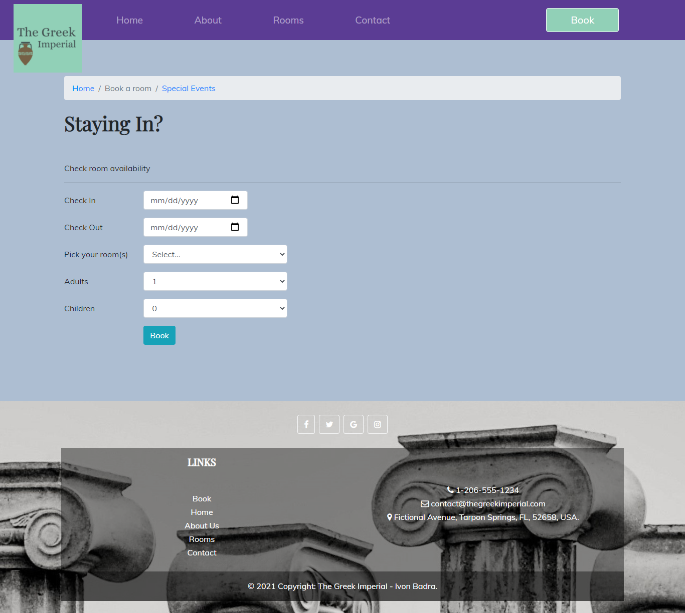
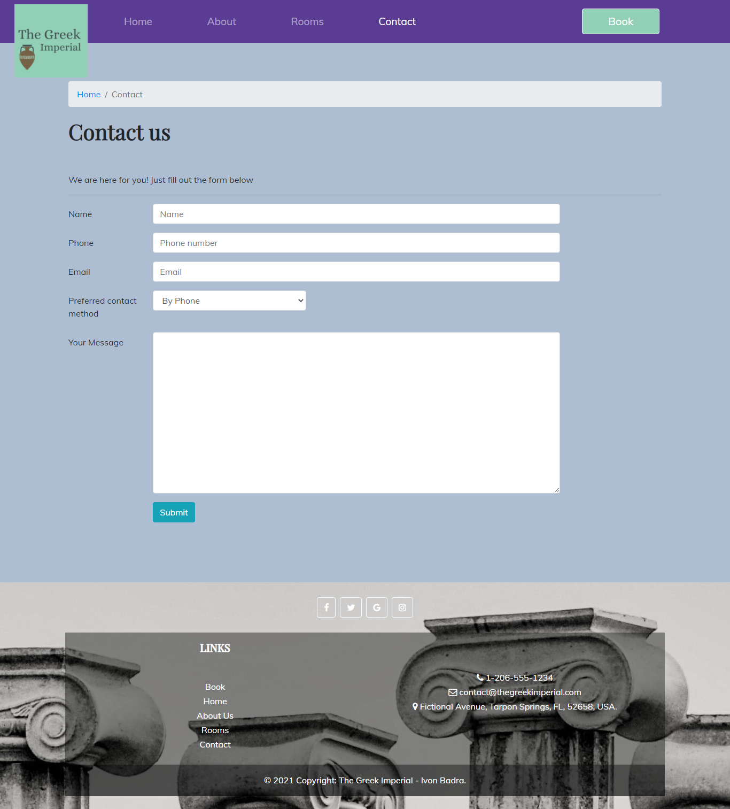

# The Greek Imperial Hotel with React.js

This website was developed for a fictional hotel located in Tarpon Springs, FL. It showcases the hotel with a brief overview and history, the amenities, accomodations (clicking on each of the different room options will provide more information), reviews and social proof sections, a map to indicate the location and attractions nearby. This is a reinvented version of the first webpage for the Greek Imperial Hotel developed with Bootstrap (see the Bootstrap version [live](https://thegreekimperialhotel.netlify.app/)). React is a JavaScript library that makes the rendering of the website content much more efficient. It only displays sections (modules) of the webpage that did change through the Virtual DOM.
\
&nbsp;

## Technologies:

\
&nbsp;
\
&nbsp;
\
&nbsp;
\
&nbsp;
\
&nbsp;
\
&nbsp;
\
&nbsp;

\
&nbsp;
\
&nbsp;

## Screenshots:

\
&nbsp;
\*Please note that bridge image looks irregular because it is a video playing in the background instead of an image. Look at it [live](https://thegreekimperialhoteltarponsprings.netlify.app/)
\
&nbsp;
\
&nbsp;
\
&nbsp;

## Features:

The website has a booking form, in which the guests can check availability and afterward they can call the hotel with a (randomly generated) reference number for their enquiry, either for a room, a ballroom or a conference room. It also features a contact form, in which customers can leave feedback, or request any special rates, accomodations, etc. At the end of the home view, users can find a newsletter subscription form. Go ahead and try submitting fictional information through this forms and take a look at the messages!

## Want to see it live? Visit the [Greek Imperial Hotel](https://thegreekimperialhoteltarponsprings.netlify.app/) website 🧳
